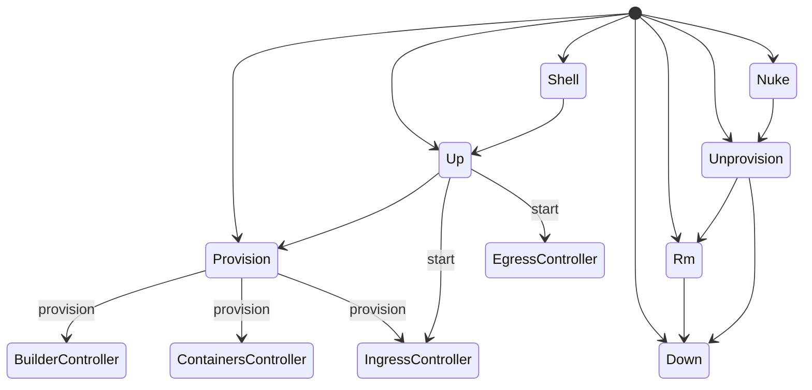

# Hab Lifecycle

```mermaid
stateDiagram-v2
    [*] --> Provision
    [*] --> Up
    [*] --> Shell
    [*] --> Down
    [*] --> Rm
    [*] --> Unprovision
    [*] --> Nuke
    Provision --> BuilderController  :provision
    Provision --> ContainersController :provision
    Provision --> IngressController :provision
    Up --> Provision
    Up --> IngressController :start
    Up --> EgressController :start
    Shell --> Up
    Rm --> Down
    Unprovision --> Down
    Unprovision --> Rm
    Nuke --> Unprovision


```
